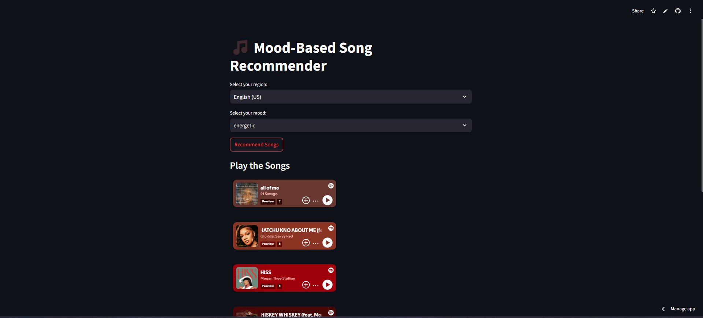

# Mood-Based Regional Song Recommender

This project is a **Mood-Based Regional Song Recommender** that leverages a machine learning model to suggest songs tailored to the user's mood and their selected region. The app is deployed using **Streamlit** for an intuitive and user-friendly interface.

## Features

- **Mood Detection**: Users input their mood (e.g., happy, sad, energetic, etc.) to receive personalized song recommendations.
- **Regional Preferences**: Users can select a region to get region-specific song recommendations.
- **Machine Learning-Powered**: The app uses a machine learning model to analyze mood and region to generate suggestions.
- **Streamlit Interface**: A clean and modern web application for seamless interaction.

## How It Works
1. The user selects their mood from a dropdown menu or inputs it manually.
2. The user selects a region from the dropdown menu.
3. The app generates a list of songs based on the mood and region, powered by the machine learning model.

## Requirements

- Python 3.7+
- Streamlit
- Pandas
- scikit-learn
- pickle

Install the dependencies using:
```bash
pip install -r requirements.txt
```

## Running the App

1. Clone the repository:
   ```bash
   git clone https://github.com/zyad-alsharnobi/Songs-Recommendations
   cd Songs-Recommendations
   ```

2. Install the dependencies as mentioned above.

3. Run the Streamlit app:
   ```bash
   streamlit run app.py
   ```

4. Open your browser at `http://localhost:8501` to interact with the app.

## Demo

Access the live demo here: [Mood-Based Song Recommender](https://songs-recommendations.streamlit.app/)

## Screenshot



## Folder Structure
```
├── app.py               # Streamlit app entry point
├── model/               # Machine learning model files
├── data/                # Dataset files
├── requirements.txt     # Python dependencies
├── screenshot.png       # App screenshot
├── README.md            # Project documentation
```

## Contributing

Feel free to open issues or submit pull requests for any improvements or new features.

## License

This project is licensed under the MIT License. See the LICENSE file for more details.

---
Thank you for using the Mood-Based Regional Song Recommender! 🎵

